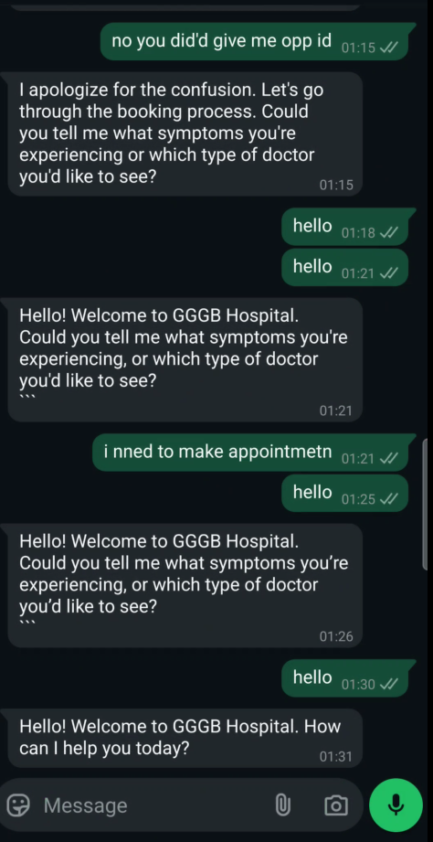
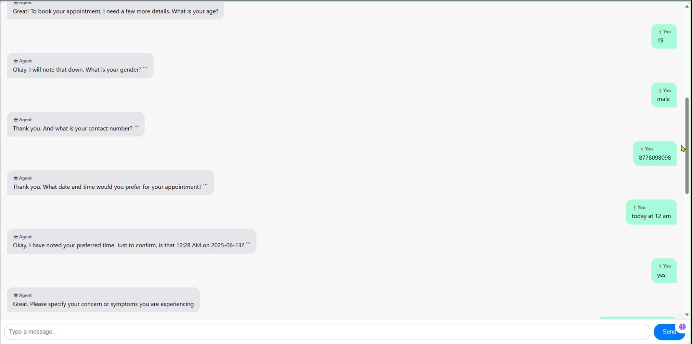

# Helix: An AI Assistant 🤖

Helix is a next-generation virtual call-center solution, harnessing agentic AI and advanced NLP to deliver 24/7 personalized support across voice, WhatsApp, and web chat. By integrating your business knowledge via Retrieval-Augmented Generation (RAG) and open-source LLMs, Helix adapts seamlessly to your brand’s tone, handles appointments and orders, and provides real-time analytics—all within a secure, scalable architecture.

---
## ▶️ Watch the Whatsapp demo
[](./whatsapp-bot.mp4)
## ▶️ Watch the Web Interface demo
[](./webpage.mp4)
## ✨ Core Highlights

- **Omni-Channel Engagement**  
  Integrates Twilio voice calls, WhatsApp Business API, and web chat for a unified customer journey.  
- **Knowledge-Grounded AI (RAG)**  
  Pulls from your FAQ/KB documents in Pinecone to produce accurate, context-aware responses.  
- **Custom AI Personas**  
  Define greetings, tone, and signature messages that reflect your brand identity.  
- **Automated Scheduling & Orders**  
  Link directly to your REST API for real-time booking, cancellations, and order tracking.  
- **Interactive Dashboards**  
  Monitor usage, success metrics, and conversation logs through a sleek React admin portal.  
- **Robust & Secure**  
  FastAPI backend, MongoDB Atlas, Pinecone vector search, RBAC auth, and end-to-end TLS encryption.

---

## 🚀 Live Deployments

Access the live Helix applications here:

- **Doctor Login Portal**  
  https://aimshelix.ownbizaccount.com/doctor_login.html  

- **Client Dashboard**  
  https://helixclient.ownbizaccount.com/  

- **Admin Portal**  
  https://helix.ownbizaccount.com/  

---

## 🛠️ Tech Stack & Architecture

| Layer            | Technology                                    |
| ---------------- | --------------------------------------------- |
| **Frontend**     | React.js • Tailwind CSS • Material UI         |
| **Backend**      | FastAPI • Uvicorn (Python)                    |
| **Databases**    | MongoDB Atlas • Pinecone Vector Store         |
| **AI / ML**      | LangChain • Open-Source LLMs • RAG Pipelines   |
| **Comm. APIs**   | Twilio Voice • WhatsApp Business API          |
| **Security**     | RBAC • TLS Encryption                         |

---

## ⚙️ Getting Started

1. **Clone**  
   ```bash
   git clone https://github.com/voice-chat-agent/WhatsApp-bot
   cd voice-chat-agent
